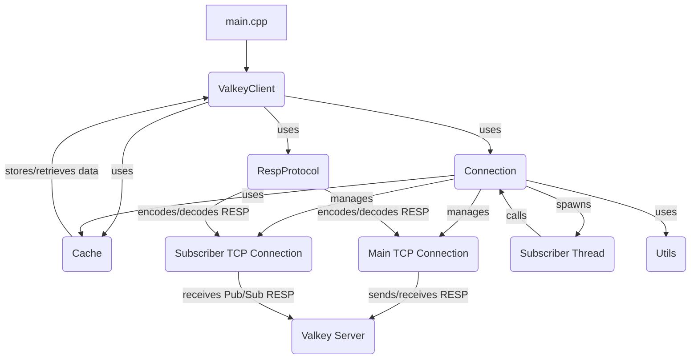

# Architecture of Valkyrie Client

The Valkyrie Client is a C++ application designed to interact with a Valkey (Redis-compatible) server. It provides a high-level API for common data operations (SET, GET, DEL, MSET, MGET, EXPIRE) and includes client-side caching capabilities with a pub/sub based invalidation mechanism.

## High-Level Design

The architecture is modular, with distinct components handling specific responsibilities:

1.  **ValkeyClient (Application Layer):**
    *   Serves as the primary interface for users to interact with the Valkey server.
    *   Encapsulates the complexities of network communication and protocol handling.
    *   Manages the lifecycle of `Connection` objects.
    *   Integrates with the `Cache` for client-side data caching.

2.  **Connection (Network Layer):**
    *   Manages the TCP connections to the Valkey server.
    *   Establishes and closes the main data connection.
    *   Manages a separate "subscriber" TCP connection for receiving cache invalidation messages via a pub/sub channel.
    *   Handles sending and receiving raw data over the network.
    *   Spawns a dedicated thread (`subscriberThread`) to asynchronously listen for pub/sub messages.

3.  **RespProtocol (Protocol Layer):**
    *   Handles the serialization and deserialization of data according to the RESP (REdis Serialization Protocol).
    *   `encode`: Converts C++ data structures (e.g., `std::vector<std::string>`) into RESP-formatted strings for sending to the server.
    *   `decode`: Parses RESP-formatted server replies into simple C++ strings.
    *   `decodeArray`: Parses RESP arrays into `std::vector<std::string>`.

4.  **Cache (Data Layer - Client-Side):**
    *   Provides a client-side in-memory cache using `std::unordered_map`.
    *   Offers functions for `lookup`, `insert`, and `erase` key-value pairs.
    *   Uses a `std::mutex` for thread-safe access to the cache map.
    *   Designed to be invalidated by pub/sub messages from the server (though the invalidation logic is currently commented out).

5.  **Utils (Utility Layer):**
    *   Contains general utility functions.
    *   Currently, it provides `generateID()` for creating unique client identifiers.

## Component Interaction Diagram

## Key Architectural Decisions

*   **Layered Design:** The separation into `ValkeyClient`, `Connection`, `RespProtocol`, and `Cache` layers promotes modularity, maintainability, and reusability.
*   **Asynchronous Pub/Sub:** A dedicated subscriber thread handles cache invalidation messages asynchronously, preventing blocking of the main client operations.
*   **RESP Protocol Abstraction:** The `RespProtocol` module abstracts away the complexities of the Valkey communication protocol, allowing `ValkeyClient` and `Connection` to focus on their core responsibilities.
*   **Client-Side Caching:** Integration of a client-side cache aims to reduce latency and load on the Valkey server.
